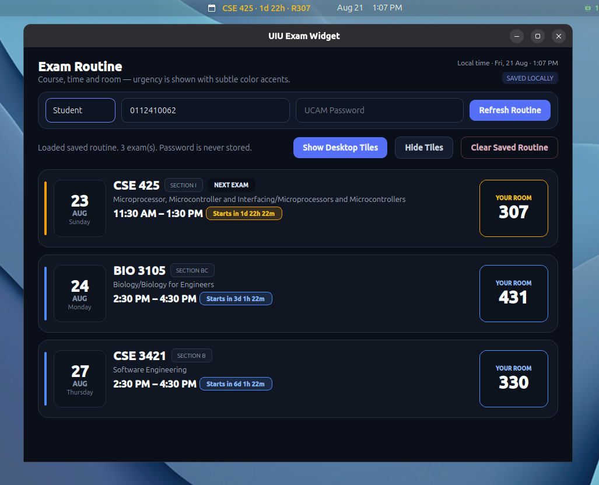

# UIU Exam Widget — MVP 2.0

This version adds a real GNOME Shell top-bar extension in addition to the main PySide6 GUI.




## Top-bar behavior

The indicator is installed in the GNOME **center box at position 0**, which places it immediately to the **left of the center clock** on the standard Ubuntu panel.

It shows only one useful status:

- Upcoming: `CSE 425 · 1d 22h · R307`
- Live exam: `CSE 425 · LIVE 1h 18m · R307`
- All exams finished: `✓ You're good now`
- No cached routine: `UIU · Fetch routine`

Clicking the indicator opens the full UIU Exam Widget. If the GUI is already running, the existing window is raised instead of opening a duplicate.

## Install the application dependencies

```bash
chmod +x install.sh run.sh
./install.sh
```

## Install the GNOME top-bar extension

```bash
chmod +x install-topbar.sh
./install-topbar.sh
```

The installer detects the local GNOME Shell major version and writes matching extension metadata.

If GNOME has not discovered the new extension yet, log out and back in once, then run:

```bash
gnome-extensions enable uiu-exam-indicator@local
```

## Data flow

The GUI continues to own ExamCon login/fetching. Passwords are never stored.

After a successful fetch it writes:

```text
~/.local/share/uiu-exam-widget/routine-cache.json
~/.local/share/uiu-exam-widget/panel-cache.json
```

`panel-cache.json` contains normalized course/start/end/room information only. The GNOME extension reads it locally and recalculates the next exam every 30 seconds. It also watches the cache directory so a refresh in the GUI appears in the panel quickly.

Existing cached routines from MVP 1.x are migrated automatically when the GUI opens, so another ExamCon login is normally not required.

## Remove only the top-bar extension

```bash
./uninstall-topbar.sh
```
