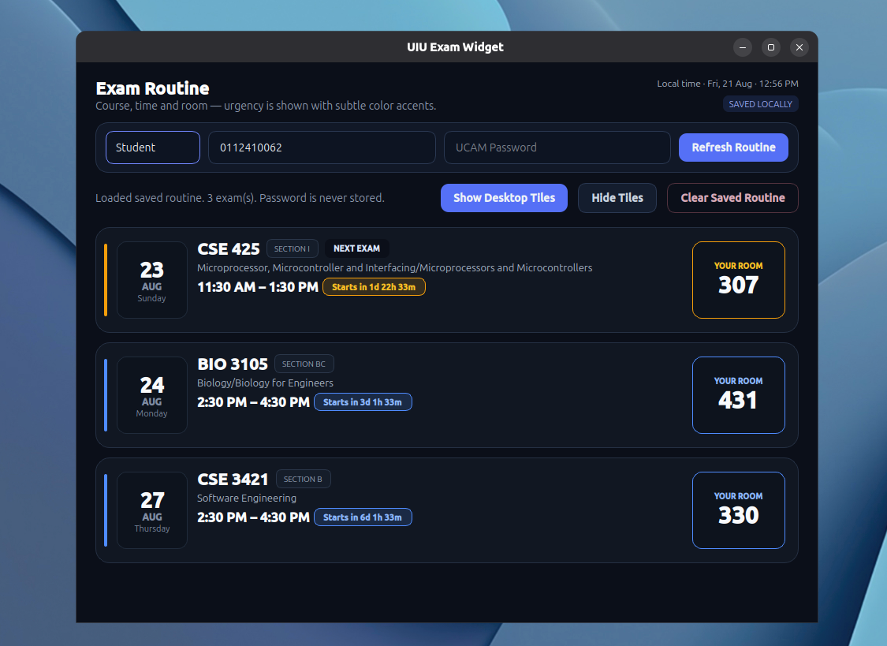

# UIU Exam Widget — MVP 1.4

Ubuntu desktop app for UIU ExamCon routines.



## What this version fixes

- Student and Faculty login modes remain separate.
- Student mode resolves the **single room assigned to the entered Student ID** from ExamCon room ranges.
- Routine data is cached locally after a successful fetch and restored on the next launch.
- Passwords are never stored.
- **Clear Saved Routine** is the only action that removes the saved routine.
- Child labels are transparent, removing the black strips/blocks seen in MVP 1.3.
- Desktop tiles have a safe minimum size so Date / Time / Room cannot overlap or collapse while resizing.
- Date and room panels stay fixed; the time panel uses the remaining width.
- Tile geometry is still remembered.
- Exam timing now uses both the **start and end time**.
- A live system-local clock is shown in the main window.
- Time status refreshes every 30 seconds:
  - `Starts in 1d 22h 56m`
  - `Starts in 42m`
  - `IN PROGRESS · 1h 18m left`
  - `Ended 24m ago`
  - `Completed`
- NEXT/LIVE highlighting updates automatically as time passes.

## Run

If dependencies are already installed from an earlier version:

```bash
chmod +x run.sh
./run.sh
```

For a fresh install:

```bash
sudo apt update
sudo apt install -y python3 python3-venv
chmod +x install.sh run.sh
./install.sh
./run.sh
```

## Saved routine

Routine cache:

```text
~/.local/share/uiu-exam-widget/routine-cache.json
```

The password is not written to this file.

## Tile resize behavior

Desktop tiles can be enlarged freely, but they cannot be shrunk below the size required for the three important blocks to remain readable. This is intentional: it prevents the text wrapping and panel overlap visible in previous versions.

## MVP 1.6.1 visual refresh

- Neutral charcoal/slate cards instead of full-card color washes.
- Thin urgency indicator on every routine card/tile.
- Urgency palette intentionally avoids blue-to-red interpolation through purple:
  - far away: blue
  - 3–7 days: cool blue
  - 1–3 days: amber
  - 6–24 hours: orange
  - under 6 hours: red
  - under 1 hour/live: bright red
- Only important UI parts carry urgency color: countdown, room outline/label, urgency bar.
- Main text/background remains stable and easy to scan.


## MVP 1.6.1 hotfix

- Fixed `Could not parse stylesheet of object StickyExamWindow` on desktop tiles.
- Urgency theme is now applied to the tile card itself.
- The thin urgency bar on desktop tiles now receives the same blue/amber/orange/red color as the main routine card.
